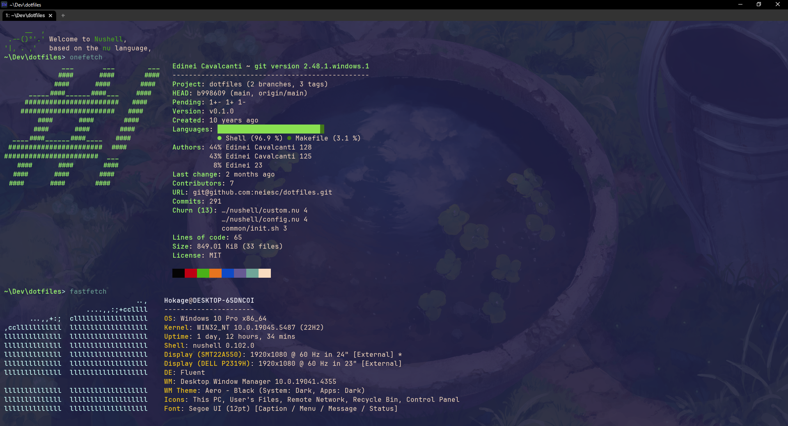

# dotfiles for Windows 11 Pro

## Windows ~~11~~ 10 Pro (Currently)

- Terminal (https://wezterm.org)
- Shell (https://www.nushell.sh)
- Font (https://jetbrains.com/mono)

## Screenshot

## Market to winget

- https://winget.run
- https://winstall.app
- https://winget.ragerworks.com