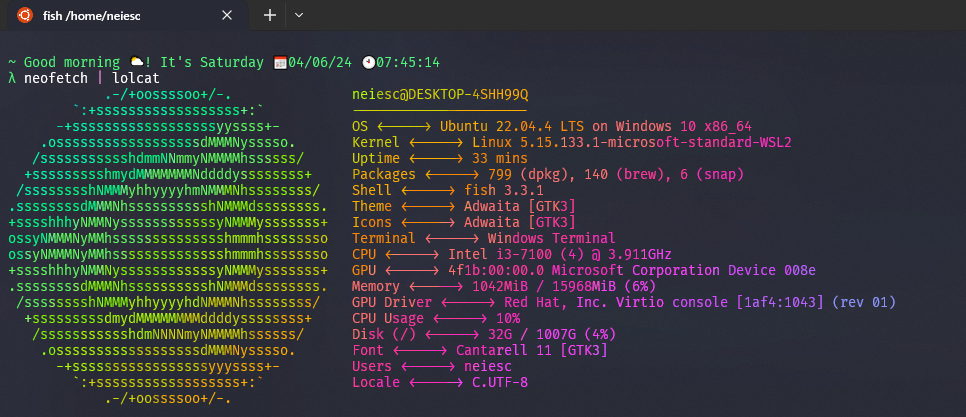

# dotfiles (GNU/Linux and Windows 10+ (WSL 2.01))

## GNU/Linux distro Archcraft (based in ArchLinux)
1. `git clone https://github.com/neiesc/dotfiles.git`
2. Run `make`

### Other commands
- `git submodule update --remote`

### [Archcraft using openbox with dracula theme](https://github.com/neiesc/archcraft-openbox-dracula)

## Screenshot

### Thanks
🙏🏼 [Archcraft](https://github.com/archcraft-os) for the best distro. 
🙏🏼 [Dracula theme](https://github.com/dracula/dracula-theme) for the best theme.
